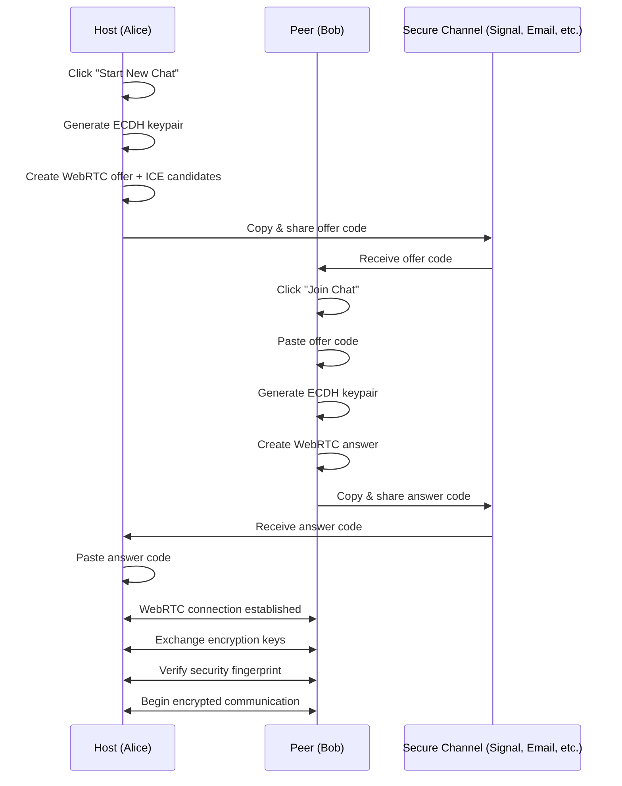
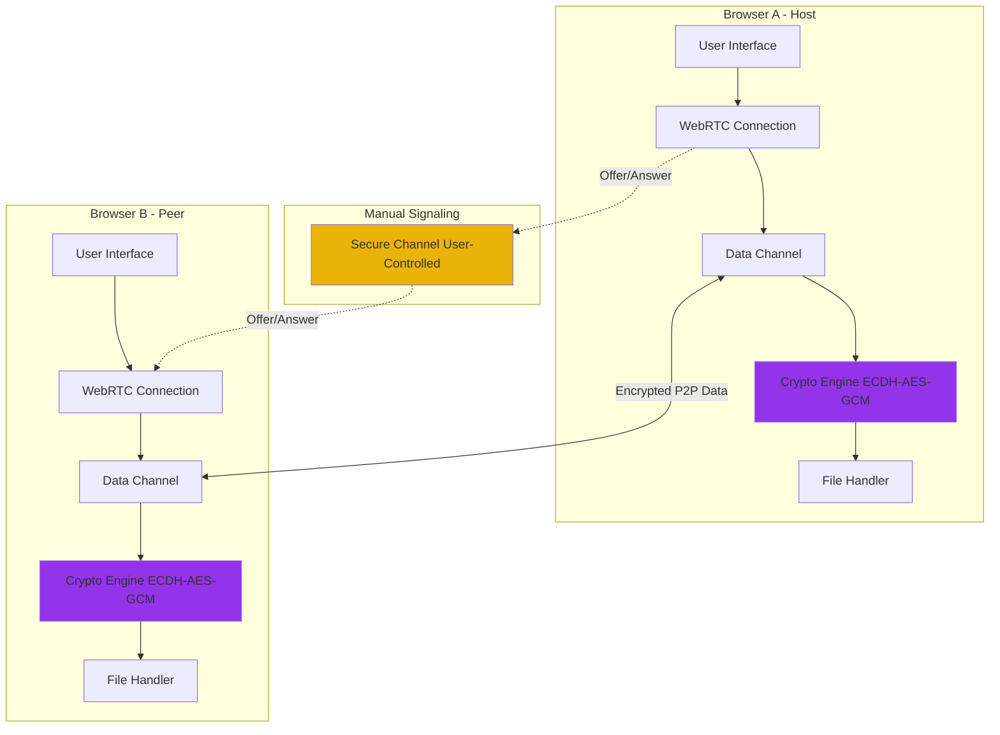
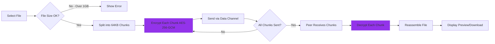

# xsukax Secure LAN P2P Chat

A privacy-focused, serverless peer-to-peer chat application designed for secure communication over local area networks (LAN). Built with pure WebRTC and modern Web Crypto APIs, this application requires zero external dependencies and operates entirely within the browser.


## 🔐 Security and Privacy Benefits

xsukax Secure LAN P2P Chat is engineered with security and privacy as core principles, implementing multiple layers of protection to ensure confidential communication:

### End-to-End Encryption
- **ECDH Key Exchange**: Elliptic Curve Diffie-Hellman (P-384 curve) establishes secure shared secrets between peers without transmitting private keys over the network
- **AES-256-GCM Encryption**: All messages and file transfers are encrypted using AES-256 in Galois/Counter Mode, providing both confidentiality and authentication
- **Unique Session Keys**: Each session generates fresh cryptographic keys, preventing key reuse across sessions
- **Encrypted File Transfers**: Files are encrypted chunk-by-chunk (64KB chunks) before transmission, ensuring large files remain secure throughout the transfer process

### Zero-Server Architecture
- **Direct Peer-to-Peer**: Communication flows directly between browsers using WebRTC data channels—no intermediate servers can intercept or log conversations
- **Manual Signaling**: Connection establishment uses manual offer/answer exchange, giving users complete control over the signaling channel
- **No Data Storage**: Messages and files exist only in memory during active sessions and are never persisted to disk or cloud storage
- **LAN Isolation**: Designed for local network operation, minimizing exposure to internet-based threats

### Privacy Features
- **Security Fingerprint Verification**: Both peers receive identical cryptographic fingerprints derived from shared secrets, enabling out-of-band verification to detect man-in-the-middle attacks
- **Anonymous Usernames**: Randomly generated usernames (e.g., "SwiftFox42") protect real identities during sessions
- **No Tracking**: Zero analytics, telemetry, or user behavior tracking—your conversations remain completely private
- **Browser-Only**: No software installation required; runs entirely in the browser sandbox with no system-level access

### Threat Mitigation
- **Ephemeral Sessions**: All session data, including messages and encryption keys, are cleared when the connection ends or the browser is closed
- **Protection Against Eavesdropping**: Military-grade encryption ensures that even if network traffic is intercepted, it cannot be decrypted without the session keys
- **Local Network Advantage**: Operating on LAN reduces attack surface compared to internet-exposed communication tools

## ✨ Features and Advantages

### Core Functionality
- **Real-Time Messaging**: Instant text communication with typing indicators
- **Large File Transfers**: Support for files up to 1GB with encrypted transmission
- **Message Management**: Edit and delete sent messages with synchronization across both peers
- **Media Previews**: Inline display of images, videos, and audio files with playback controls
- **Rich File Support**: Download any file type with automatic preview for common media formats

### Technical Advantages
- **Zero Dependencies**: No external libraries required—built entirely on native browser APIs (WebRTC, Web Crypto, RTCDataChannel)
- **Single File Deployment**: The entire application is contained in one HTML file (`index.html`) for maximum portability
- **Cross-Platform**: Works on any modern browser (Chrome, Firefox, Edge, Safari) across Windows, macOS, Linux, iOS, and Android
- **Lightweight**: Minimal resource footprint with no background services or system integrations
- **Open Source**: Fully transparent codebase allows security audits and community contributions

### User Experience
- **Intuitive Interface**: Clean, modern UI with responsive design for desktop and mobile devices
- **No Registration**: Start chatting immediately without accounts, email verification, or personal information
- **Connection Persistence**: Sessions maintain state during page refreshes (when possible)
- **Visual Feedback**: Clear status indicators, progress bars for file transfers, and system notifications

### Network Benefits
- **LAN Optimized**: Designed specifically for local networks with reduced latency and high bandwidth utilization
- **NAT Traversal**: Built-in STUN server support enables connections across network boundaries
- **Reliable Transfer**: Chunked file transmission with progress tracking ensures successful delivery of large files

## 📦 Installation Instructions

xsukax Secure LAN P2P Chat requires no traditional installation process. Follow these simple steps:

### Method 1: Direct Download
1. Download `index.html` from the [GitHub repository](https://github.com/xsukax/xsukax-Secure-LAN-P2P-Chat)
2. Save the file to any location on your computer
3. Double-click `index.html` to open it in your default web browser
4. The application is now ready to use

### Method 2: Clone Repository
```bash
# Clone the repository
git clone https://github.com/xsukax/xsukax-Secure-LAN-P2P-Chat.git

# Navigate to the directory
cd xsukax-Secure-LAN-P2P-Chat

# Open index.html in your browser
# On Linux/macOS:
xdg-open index.html  # or open index.html

# On Windows:
start index.html
```

### Method 3: Web Server (Optional)
For advanced users who prefer serving via HTTP:
```bash
# Using Python 3
python -m http.server 8000

# Using Node.js (http-server)
npx http-server

# Then navigate to http://localhost:8000/index.html
```

### System Requirements
- **Browser**: Chrome 80+, Firefox 75+, Edge 80+, Safari 14+, or any modern browser with WebRTC support
- **Operating System**: Windows 7+, macOS 10.12+, Linux (any distribution), iOS 14+, Android 7+
- **Network**: Local Area Network (LAN) connectivity between devices
- **Permissions**: Browser must allow clipboard access for copying connection codes

## 📖 Usage Guide

### Connection Establishment Process

The application uses a manual signaling process to establish secure peer-to-peer connections. This approach maximizes privacy by allowing users to exchange connection information through any trusted channel.



### Step-by-Step Workflow

#### For the Host (Session Initiator)

1. **Start Session**
   - Open `index.html` in your browser
   - Click the **"Start New Chat"** button
   - Wait for the connection offer to be generated

2. **Share Offer**
   - Click **"Copy Offer"** to copy the connection code to your clipboard
   - Share this code with your peer through a secure channel (Signal, encrypted email, in-person, etc.)
   - **Important**: This code contains your public key and network information but cannot decrypt messages

3. **Receive Answer**
   - Wait for your peer to send back their answer code
   - Paste the answer code into the **"Paste Peer's Answer"** text area
   - Click **"Submit Answer"**

4. **Verify Connection**
   - Once connected, compare the **security fingerprint** with your peer via phone, video call, or in person
   - If fingerprints match, the connection is secure
   - If they don't match, terminate the connection immediately (possible MITM attack)

#### For the Peer (Session Joiner)

1. **Join Session**
   - Open `index.html` in your browser
   - Click **"Join Chat"**
   - Paste the offer code you received from the host
   - Click **"Connect"**

2. **Share Answer**
   - After processing the offer, an answer code will be generated
   - Click **"Copy Answer"** to copy the code
   - Send this code back to the host through the same secure channel

3. **Verify Connection**
   - Once the host submits your answer, the connection will establish
   - Compare the **security fingerprint** with the host
   - Begin chatting once fingerprints are verified

### Application Architecture



### Sending Messages

1. Type your message in the input field at the bottom of the chat interface
2. Press **Enter** or click the **"Send"** button
3. Messages are automatically encrypted before transmission
4. Your peer receives and decrypts the message instantly

### Managing Messages

**Edit a Message:**
- Hover over any message you sent
- Click the **"Edit"** button
- Modify the text in the modal dialog
- Click **"Save"** to update the message for both users

**Delete a Message:**
- Hover over any message you sent
- Click the **"Delete"** button
- The message will show as "Message deleted" for both users

### Sending Files

1. Click the **attachment icon** (paperclip) next to the message input
2. Select a file from your device (maximum 1GB)
3. The file is encrypted and transmitted in 64KB chunks
4. A progress bar displays the upload status
5. Both users see the file with:
   - Inline preview for images, videos, and audio
   - Download button for all file types

### File Transfer Process



### Security Fingerprint Verification

The security fingerprint is a cryptographic hash of the shared secret between you and your peer. Verifying this fingerprint is crucial to ensure no attacker has intercepted the connection.

**Verification Steps:**
1. Click **"Info"** next to the yellow fingerprint bar in the chat interface
2. Read your fingerprint aloud to your peer via phone or video call
3. Your peer should see the identical fingerprint (e.g., `A3F2 B8C1 9D4E 7F23 C5A8 1B6D 4E9F 2A7C`)
4. If fingerprints match: ✅ Connection is secure
5. If fingerprints differ: ⚠️ Terminate immediately and investigate

### Ending a Session

1. Click the **"End"** button in the bottom right corner
2. Confirm your choice in the modal dialog
3. The connection is closed and all session data is cleared
4. To start a new session, refresh the page or click **"Start New Chat"**

### Troubleshooting

**Connection Failed:**
- Ensure both devices are on the same LAN
- Check firewall settings (WebRTC requires UDP ports)
- Verify offer/answer codes were copied completely
- Try refreshing both browsers and starting over

**File Transfer Interrupted:**
- Check network stability
- Ensure the recipient's browser tab remains active
- Reduce file size or try splitting into multiple smaller files

**Messages Not Sending:**
- Verify the data channel status (green indicator in header)
- Check browser console for errors (F12)
- Ensure JavaScript is enabled

## 🛠️ Technical Details

### Encryption Specifications
- **Key Exchange**: ECDH with P-384 elliptic curve
- **Symmetric Encryption**: AES-256-GCM
- **Key Derivation**: SHA-256 for fingerprint generation
- **IV Generation**: Cryptographically secure random 12-byte nonces

### WebRTC Configuration
- **ICE Servers**: STUN server (`stun:stun.l.google.com:19302`)
- **Data Channel**: Ordered, reliable transmission
- **Chunk Size**: 64KB for file transfers
- **Max File Size**: 1GB (1,073,741,824 bytes)

### Browser Compatibility
| Browser | Version | Status |
|---------|---------|--------|
| Chrome | 80+ | ✅ Fully Supported |
| Firefox | 75+ | ✅ Fully Supported |
| Edge | 80+ | ✅ Fully Supported |
| Safari | 14+ | ✅ Fully Supported |
| Opera | 67+ | ✅ Fully Supported |

## 🤝 Contributing

Contributions are welcome! Please follow these guidelines:

1. Fork the repository
2. Create a feature branch (`git checkout -b feature/AmazingFeature`)
3. Commit your changes (`git commit -m 'Add some AmazingFeature'`)
4. Push to the branch (`git push origin feature/AmazingFeature`)
5. Open a Pull Request

### Development Guidelines
- Maintain zero external dependencies
- Preserve the single-file architecture
- Follow existing code style and conventions
- Add comments for complex cryptographic operations
- Test on multiple browsers before submitting

## 📄 License

This project is licensed under the GNU General Public License v3.0.

## 🙏 Acknowledgments

- Built with native Web APIs: WebRTC, Web Crypto API, RTCDataChannel
- STUN server provided by Google for ICE candidate gathering
- Inspired by the principles of privacy, security, and user sovereignty

## 📞 Support

For issues, questions, or feature requests:
- Open an issue on [GitHub Issues](https://github.com/xsukax/xsukax-Secure-LAN-P2P-Chat/issues)
- Review existing issues before creating duplicates
- Provide browser version, OS, and steps to reproduce any bugs

## 🔒 Security Disclosure

If you discover a security vulnerability, please **do not** open a public issue. Instead:
1. Email security details privately to the repository maintainer
2. Allow reasonable time for a fix to be developed
3. Coordinate public disclosure after a patch is available

---

**Stay secure. Stay private. Chat freely.**
